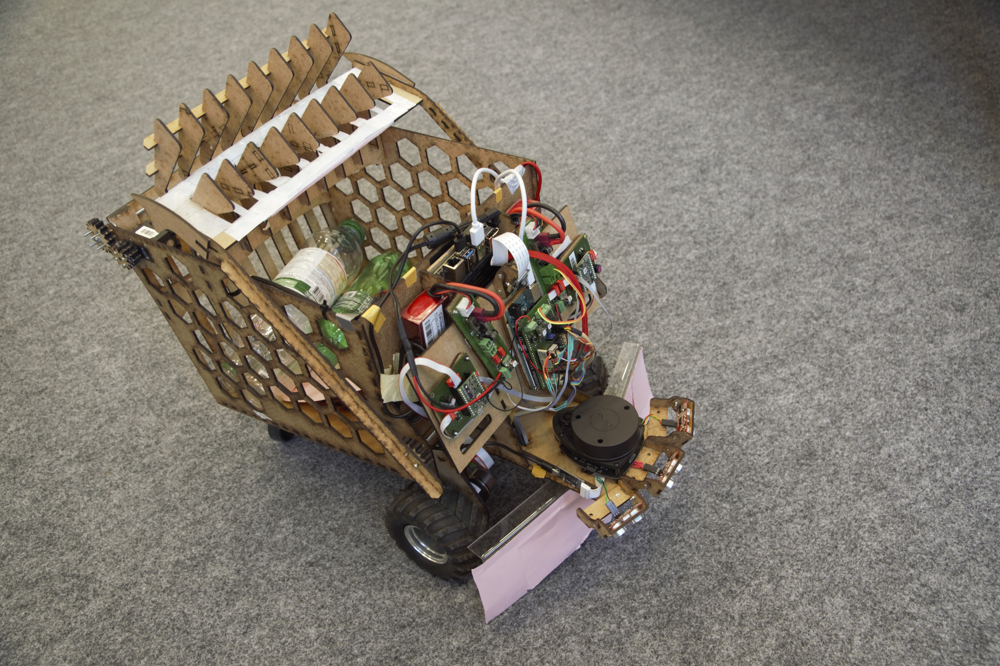
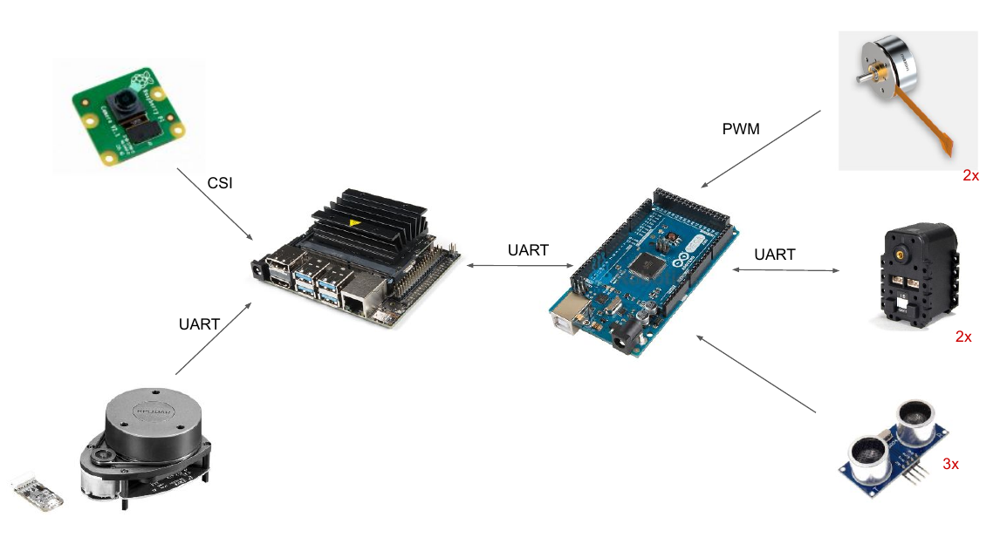
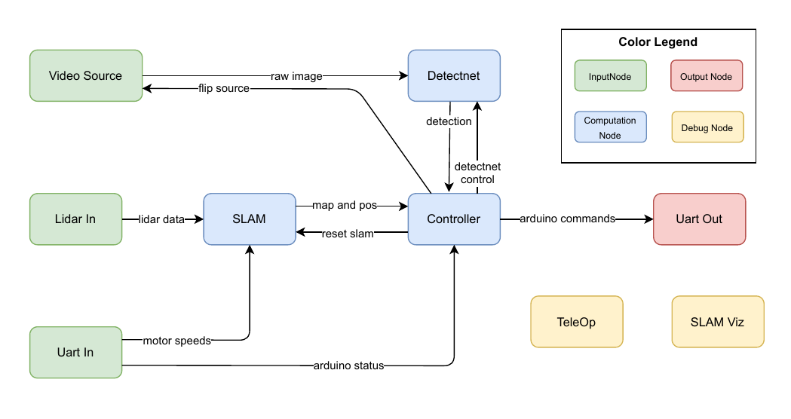
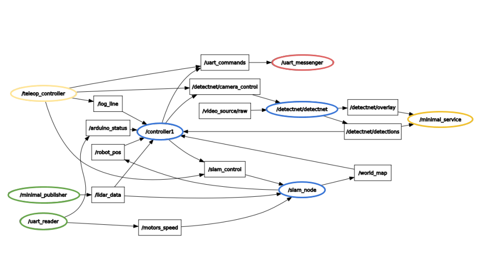
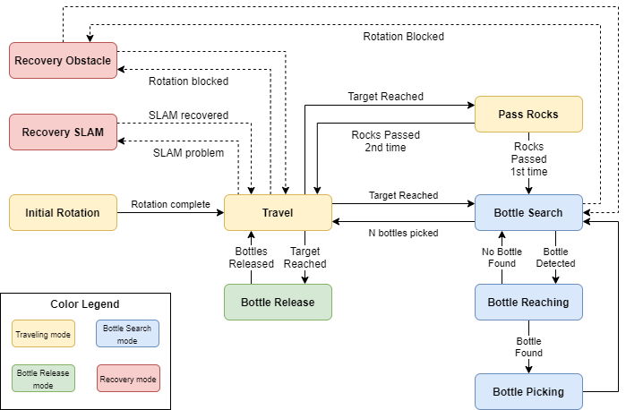

# The Robottle Project

Robottle is an autonomous Robot that is able to collect bottles in a random environment with obstacles by constructing a map of its environment using SLAM with a RPLidar, and detecting bottles using Deep Neural Network ran on the GPU of a Jetson Nano Boad. 

Here is a [youtube presentation](https://youtu.be/XJpJSuhSZN4) of the project ! It was done for a semester project at EPFL and we are not working on this anymore. All the code is well documented. 

There is a report that describes the entire project and is accessible [here](report.pdf)

## The project in more details 

Readers are encouraged to give a look at the report. However it is really long and we provide here a smaller explanation of the project. 

**Note 1**: All the algorithms are explained in the section 5.2 of the report. If there would be only 1 section to be read, it is this one. 

**Note 2**: All the 2D plans of the robot are available at the end of the report. It can be completely built with a laser-cutter machine only using wood. 

Robottle was designed for an academic competition at EPFL. For 10 minutes, the robot must autonomsouly collect bottle in an arena filled with bottles and bring them back to one of the corner of the arena, the recycling arena. 

Robottle has 2 processing unit: a **Jetson Nano** that is in charge of all the high-level parts of the softwares (computation and control decisions), and a **Arduino Mega** which is in charge of all the low-level parts of the software (controlling the motors). Here is an diagram of the electrical componenents of Robottle. 

This repository contains the main components of the high-level code that the Jetson uses for controlling the robot. In this repository, you can find
- all the ROS nodes to read sensors inputs, run the controller, and send orders to the Arduino
- an implementation of SLAM using ROS2 in Python based on the Lidar measurements 
- most importantly, the code of the [controller](src/robottle/robottle/controller1.py)

The ROS code works in pair with the [Robottle Python Package](https://github.com/arthurBricq/robottle_python_packages) where there are some helper functions and algorithms. 

As the code of this repository and the code of the **Robottle Python Package** are constituting the **high-level controller**, the code of the Arduino Mega **low-level controller** is accessible [here](https://github.com/ljacqueroud/Robottle-low-level). 

The following diagram provides a 'clear' view of the ROS diagram. 

And this diagram was extracted with `rqt_graph` and provides all the real topics. 

## More about the controller

From the previous diagram, one understands that everything is turning around the **controller**. This controller is the part of the code in charge of taking the decisions given all the available data. 

The 'available' data includes
1. the Lidar Data
2. the SLAM outputs (map and position)
3. the raw image
4. the detected bottles by Neural Network (bouding box)
5. the motor speeds
6. the status sent by the arduino 

The 'decisions' that the controller includes
1. how to move the robot
2. when to pick a bottle
3. when to drop the bottles

The controller is actually a **state-machine** rather complexe and here is a description of the states it goes through. 

What really matters is a succession of **travel phases** and of **bottle search mode**. 

## Other repositories used 

For the *Cuda-Accelerated* code for the **Neuron Network** to detect bottles was based on the [Jetson-Inference](https://github.com/dusty-nv/jetson-inference) code (*NVidea*) and especially with their detectnet code. Their ROS repository has a [documentation](https://github.com/dusty-nv/ros_deep_learning) that is quite complete ! *However, it is writen all in C*

## Some useful commands 

The setup to work with the Jetson Nano is rather difficult and it is really easy to loose time just to 'do simple tasks'. So here is a list of many simple linux / ROS commands that can help someone work in their project. 

- commands to compile code

`cd $PYTHON_PATH ; git pull ; sudo python3 setup.py install`

`cd $ROS_PATH ; git pull ; colcon build --packages-select robottle`

- ssh command to open a shell, go to proper directory, and open ros

`ssh arthur@M00e04c3fd2f6.dyn.epfl.ch`

`cd dev/ros/workspace1 ; . install/setup.bash ; `

- ssh copy file

`scp -r arthur@M00e04c3fd2f6.dyn.epfl.ch:/home/arthur/dev/ros/workspace1/bag_files/freq_test /home/arthur/dev/ros/ros_robottle/bag_files/` 

- scp copy file for many files

`scp -r arthur@M00e04c3fd2f6.dyn.epfl.ch:/home/arthur/dev/ros/data/maps/rects/name* /home/arthur/dev/ros/data/from_jetson/`

- bag files recording sensor inputs (lidar data + motors speed so far)

`ros2 bag record -o name /lidar_data /motors_speed`

- run the teleop controller

`ros2 run robottle teleop`

- launch the other ROS nodes (LIDAR, Motors Speed Reader, SLAM, Motors Commands)

`ros2 launch robottle launch_nocontroller.launch.py`

`ros2 launch robottle bottle_picking.launch.py`

- launch the detectnet node (*with its own launch files*)

`ros2 launch ros_deep_learning detectnet.ros2.launch input:=csi://0 output:=display://0`

*It's possible to have (or not) an output when this node is launched, but for it we must change the launch file. Later, I will integrate this in my own launch nodes*

- topic publication to move the robot somewhere

`ros2 topic pub --once /uart_commands std_msgs/msg/String "data: w"`

- copy the bag files to the flashdrive

`ros2 bag record -o name /lidar_data /motors_speed`

- mount the file with all the pictures

`sshfs arthur@M00e04c3fd2f6.dyn.epfl.ch:/home/arthur/dev/ros/data/maps/rects/ /home/arthur/dev/ros/ros_robottle/mount`

or 

`xdg-open dev/ros/data/maps/rects/`

## Start-up script

The startup scripts will launch all the ROS2 nodes by (1) placing the **detectnet nodes** in the **background** and all the **Robottle nodes** in the foreground. 

Users can use 
- the `jobs` command to list the jobs currently launched. 
- the `fg` command to open the first background job into the foreground
- (or the `fg 2` command to put the second job in the foreground)
- Once a job is in the foreground, all the associated ROS nodes can be killed by pressing **CTRL-C**

The script is launched using Systemd at boot. Once the script is launched, all the ros nodes can be killed (in SSH) with the command 

`sudo systemctl stop autostart`

## Our ROS Nodes

Here is a description of the nodes we created for the robot. 

### Input Nodes

- **lidar_publisher.py**: Reads data from lidar as send them as collected in the topic `lidar_data`
- **uart_speed_reader.py**: Reads the speed from the motors, using UART communications and send them in topic `uart_motors_speed`. 
- **detectnet.py**: Reads the camera and returns the bounding boxes. This package was made by NVidea and here is its [documentation](https://github.com/dusty-nv/ros_deep_learning). Here are different topics one other node can subscribe to
    - `image_in`: simply the raw image
    - `detections`: the bounding boxes
    - `vision_info`: vision metadata
    - `overlay`: the image with the bounding boxes drawn on top of it

### Internal Nodes (i.e. the brain)
- **slam.py**: SLAM node (evaluate position and map). It outputs on topics `world_map` and `robot_pos`. It is an implementation of the 'TinySLAM' algorithm, which is built locally from this repository: [BreezySLAM](https://github.com/simondlevy/BreezySLAM). *Some portion of this code needs to be modified*
- **controller_ol.py**: most basic controller, will avoid obstacles merely based on the SLAM output. It then communicates commands to the node *uart_messenger* (which then transfer them to the Arduino Mega)
- **controller1.py**: it's going to be the first controller that makes the robot run autonomously. Work in progress. 
- **vision_analyser.py**: service manager that can (i) take a picture on demand by subscribing to one of **detectnet** topics (to get 1 raw image input from the streamline) and (ii) analyse it straigth away. Offered services are the followings:
    - 'find_map_corners': take a picture and return angle change from beacons present on the image. Work in progress.

### OutputNodes 
- **uart_messenger.py**: sends UART message containing desired motor actions to Arduino Mega. Reads from topic `uart_commands`

### Debugging Nodes
*Those nodes are not intended to be ran on the Jetson Nano*
- **slam_vizualiser.py**: prints the map and the position in another window.
- **teleop.py**: controls the robot remotely using keyboard.

## ROS Hyperparameters

As the code is rather complex, there are several hyperparameters and it is sometimes hard to keep track of what is tunnable and what is not. Here is a list of all the hyperparameters of our code. 

**SLAM**
- detection_margin: it's an angle which define the datapoints of the LIDAR to be excluded (because it sees the robot). It was found that the best (i.e. the min) value is 65.
- offset_mm: It's the shift in the axis of the robot between the center of rotation and the center of the lidar.
- map_quality: It's the speed of integration of the new measurements from LIDAR to SLAM, between 0 and 255. 
- hole_width_mm: It's the width of obstacles that SLAM assumes when one is seen by the LIDAR. 
- 'initial_angle': (TODO) it's the initial angle of the robot in the arena. Zero is when robot is parallel to the wall which goes to the zone 2.
- MIN_SAMPLE: minimum number of datapoints that a LIDAR batch of data must contain so that the SLAM takes them into account. 

**Map Analysis**
- threshold: binary threshold applied to the SLAM occupancy grid. 
- kernel_size: size of the kernel of a median filter applied to the binary grid
- N_points_min: contour detection is performed above filtered binary grid. It's the minimum number of points a contour must have in order to be considered as 'valid' and kept for future analysis
- area_threshold: minimum area of a rotated rectangle to be considered as valid.

## Differences between Jetson and Personal Computer

There are differences between the different setups, because the Jetson has to do things that I will not try to replicate at home (and just there results)

- ros_deep_learning: this is the ROS package for CUDA realtime accelerated neuron network. It is present only on the Jetson and not on the shared code. The only thing one has to include are the interfaces : "vision_msgs" (https://github.com/Kukanani/vision_msgs)

