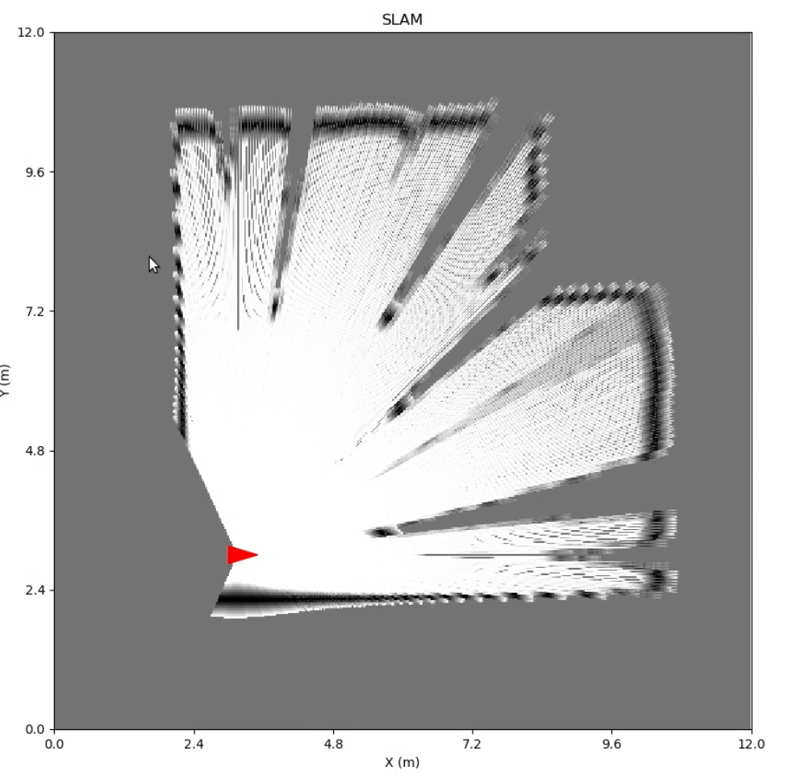
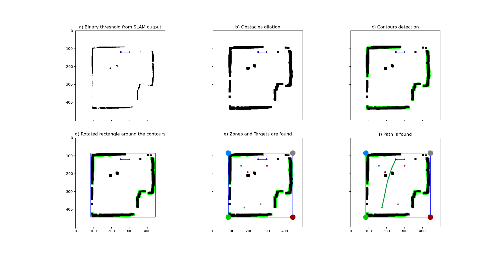
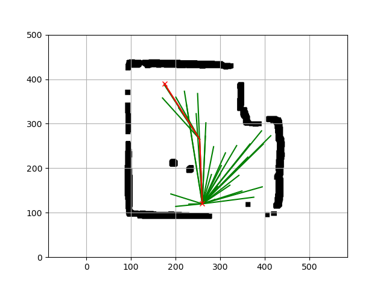
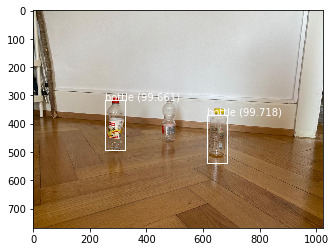

# The Robottle Project

Robottle is an autonomous Robot that is able to collect bottles in a random environment with obstacles by constructing a map of its environment using SLAM with a RPLidar, and detecting bottles using Deep Neural Network ran on the GPU of a Jetson Nano Boad. 

Here is a [youtube presentation](https://youtu.be/XJpJSuhSZN4) of the project ! It was done for a semester project at EPFL and we are not working on this anymore. All the code is well documented. 

There is a report that describes the entire project and is accessible [here](report.pdf)

## The project in more details 

Readers are encouraged to give a look at the report. However it is really long and we provide here a smaller explanation of the project. 

**Note 1**: All the algorithms are explained in the section 5.2 of the report. If there would be only 1 section to be read, it is this one. 

**Note 2**: All the 2D plans of the robot are available at the end of the report. It can be completely built with a laser-cutter machine only using wood. 

Robottle was designed for an academic competition at EPFL. For 10 minutes, the robot must autonomsouly collect bottle in an arena filled with bottles and bring them back to one of the corner of the arena, the recycling arena. 

Robottle has 2 processing unit: a **Jetson Nano** that is in charge of all the high-level parts of the softwares (computation and control decisions), and a **Arduino Mega** which is in charge of all the low-level parts of the software (controlling the motors). Here is an diagram of the electrical componenents of Robottle. 

This repository contains the main components of the high-level code that the Jetson uses for controlling the robot. In this repository, you can find
- all the ROS nodes to read sensors inputs, run the controller, and send orders to the Arduino
- an implementation of SLAM using ROS2 in Python based on the Lidar measurements 
- most importantly, the code of the [controller](src/robottle/robottle/controller1.py)

The ROS code works in pair with the [Robottle Python Package](https://github.com/arthurBricq/robottle_python_packages) where there are some helper functions and algorithms. 

As the code of this repository and the code of the **Robottle Python Package** are constituting the **high-level controller**, the code of the Arduino Mega **low-level controller** is accessible [here](https://github.com/ljacqueroud/Robottle-low-level). 

The following diagram provides a 'clear' view of the ROS diagram. 

And this diagram was extracted with `rqt_graph` and provides all the real topics. 

## More about the controller

From the previous diagram, one understands that everything is turning around the **controller**. This controller is the part of the code in charge of taking the decisions given all the available data. 

The 'available' data includes
1. the Lidar Data
2. the SLAM outputs (map and position)
3. the raw image
4. the detected bottles by Neural Network (bouding box)
5. the motor speeds
6. the status sent by the arduino 

The 'decisions' that the controller includes
1. how to move the robot
2. when to pick a bottle
3. when to drop the bottles

The controller is actually a **state-machine** rather complexe and here is a description of the states it goes through. 

What really matters is a succession of **travel phases** and of **bottle search mode**. 

### Travel Phase

In travel mode, the controller uses the output of the SLAM and some metadata about the arena to extract targets. Once targets are found, the controller uses an **RRT** algorithm to find a path and a simple path tracking algorithm is applied to make the robot travel. 

This is what the SLAM output looks like. A big, fat, matrix of 8 bits integers. It is really hard to work with this output and some image analysis must be applied to this matrix to extract relevant features. 

Here is an illustration of the **image analysis pipeline** that is applied to the SLAM output (treated as a grayscale image, which is actually what it is) to extract from the SLAM output the targets of the arena.

Once this pipeline is finished comes (last picture) the path planner. It is a RRT Star algorithm. It's a random tree that grows in the non convex space of the arena until a path is found. An image is better than 1000 words to explain how it works. 

Curious readers are invited to visit section 5.2 of the report. 

### Bottle Picking Phase

This phase corresponds to the blue states in the state diagram above. To explain in a few words what happens: the robot activate the neural network detections and turns around until bottles are detected (usually, this happens really quickly). Once a bottle is found, we estimate the angle at which the bottle is located using a regressive polynomial function on the bounding box of the image. The robot is going to align perfectly with the bottle and then move forward until the bottle is detected by the ultrasonic sensors. Then Robottle collects the bottle and start again rotating. 

Just to illustrates, here is what Robottle sees with the neural network.

## Other repositories used 

All this work would not have been possible without all the open source contributions that we have found. 

The *Cuda-Accelerated* code for the **Neuron Network** (to detect bottles) was based on the great [Jetson-Inference](https://github.com/dusty-nv/jetson-inference) code (from *NVidea*) and especially with their **detectnet** tool. They even provide a ROS repository, it has a great [documentation](https://github.com/dusty-nv/ros_deep_learning) that is quite complete ! We have done a few modifications to this code, to 
- be able to flip the source image (read the report to understand why ! Section 5.2.4)
- be able to turn OFF the detection without killing the ROS Node, to avoid over-heating

The SLAM code is an implementation of the 'TinySLAM' algorithm, which is built locally from this brilliant repository: [BreezySLAM](https://github.com/simondlevy/BreezySLAM). Here too we have changed the code a little bit, most of which can be seen in our ROS [SLAM Node](src/robottle/robottle/slam.py).

The LIDAR code to read from the Lidar was found under this very easy to use [librairy](https://github.com/SkoltechRobotics/rplidar).

## Some useful commands 

The setup to work with the Jetson Nano is rather difficult and it is really easy to loose time just to 'do simple tasks'. So here is a list of many simple linux / ROS commands that can help someone work in their project. 

- commands to compile code

`cd $PYTHON_PATH ; git pull ; sudo python3 setup.py install`

`cd $ROS_PATH ; git pull ; colcon build --packages-select robottle`

- ssh command to open a shell, go to proper directory, and open ros

`ssh arthur@M00e04c3fd2f6.dyn.epfl.ch`

`cd dev/ros/workspace1 ; . install/setup.bash ; `

- ssh copy file

`scp -r arthur@M00e04c3fd2f6.dyn.epfl.ch:/home/arthur/dev/ros/workspace1/bag_files/freq_test /home/arthur/dev/ros/ros_robottle/bag_files/` 

- scp copy file for many files

`scp -r arthur@M00e04c3fd2f6.dyn.epfl.ch:/home/arthur/dev/ros/data/maps/rects/name* /home/arthur/dev/ros/data/from_jetson/`

- bag files recording sensor inputs (lidar data + motors speed so far)

`ros2 bag record -o name /lidar_data /motors_speed`

- run the teleop controller

`ros2 run robottle teleop`

- launch the other ROS nodes (LIDAR, Motors Speed Reader, SLAM, Motors Commands)

`ros2 launch robottle launch_nocontroller.launch.py`

`ros2 launch robottle bottle_picking.launch.py`

- launch the detectnet node (*with its own launch files*)

`ros2 launch ros_deep_learning detectnet.ros2.launch input:=csi://0 output:=display://0`

*It's possible to have (or not) an output when this node is launched, but for it we must change the launch file. Later, I will integrate this in my own launch nodes*

- topic publication to move the robot somewhere

`ros2 topic pub --once /uart_commands std_msgs/msg/String "data: w"`

- copy the bag files to the flashdrive

`ros2 bag record -o name /lidar_data /motors_speed`

- mount the file with all the pictures

`sshfs arthur@M00e04c3fd2f6.dyn.epfl.ch:/home/arthur/dev/ros/data/maps/rects/ /home/arthur/dev/ros/ros_robottle/mount`

or 

`xdg-open dev/ros/data/maps/rects/`

## Start-up script

The startup scripts will launch all the ROS2 nodes by (1) placing the **detectnet nodes** in the **background** and all the **Robottle nodes** in the foreground. 

Users can use 
- the `jobs` command to list the jobs currently launched. 
- the `fg` command to open the first background job into the foreground
- (or the `fg 2` command to put the second job in the foreground)
- Once a job is in the foreground, all the associated ROS nodes can be killed by pressing **CTRL-C**

The script is launched using Systemd at boot. Once the script is launched, all the ros nodes can be killed (in SSH) with the command 

`sudo systemctl stop autostart`

