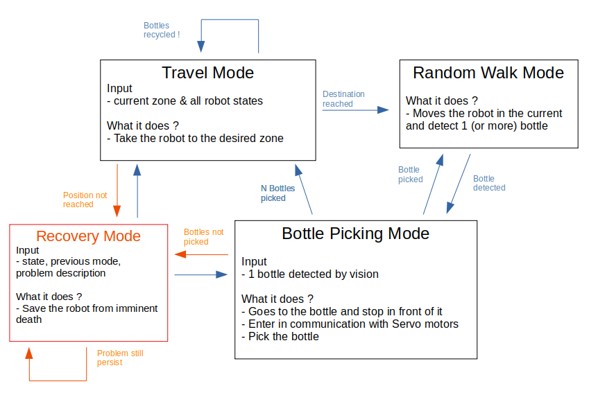

# Robottle Controller 1

First Robot Autonomous Controller is a State Machine performing Random Walk to Collect bottles. This files reports a documentation of this controller and lays out what needs to be done.

## State Machine Description

### Travel Mode

In this state, the robot must travel to another zone - where we know it's going to make more points. Several situations can occurs:
1. The robot will go pick bottles in another new (*not explored*) zone: **exploration mode**. For now, we assume in this mode that the robot is in the recycling area and that it is empty. However, we don't assume any orientation of the robot. 
2. The robot will come back at the **recycling area** to drop its bottles: **return mode** 

What information does the algorithm needs to **make the robot travel to the desired zone** ?
- (i1) = **the desired zone**: it is easy to get those, we simply keep an array `desired_zones` and `visited_zones`, then make a substraction of those 2 sets to extract where we want to go.
- (i2) = **robot state & environment**: it is the output of the SLAM (*needs an evaluation*)
- (i3) = **position of the desired end position in the environment**: this is the hardest part. 

### Random walk Mode

### Bottle Picking Mode
